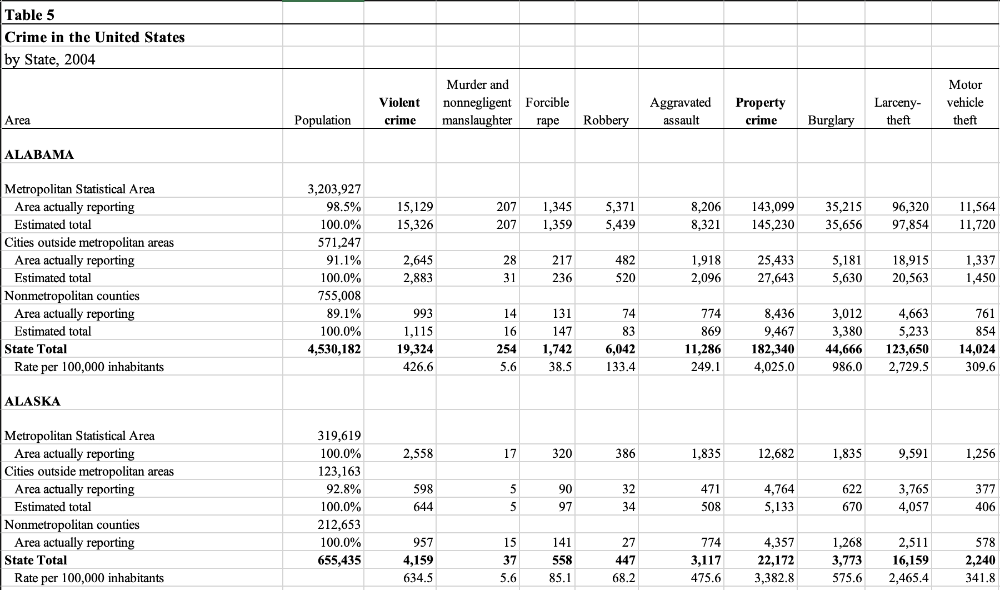

# Data 

## Sources

As described in the proposal, we look at three types of data over time:

### Crime

Crime data is sourced using the [Uniform Crime Reporting (UCR) program](https://www.fbi.gov/how-we-can-help-you/need-an-fbi-service-or-more-information/ucr "Uniform Crime Reporting (UCR) program"). More than 18,000 law enforcement agencies at different administrative levels (from federal to city) voluntarily submit data to the state UCR or directly to FBI's UCR. The UCR program is used by criminal justice researchers and students.

Yearwise UCR data is visited using the [index of UCR publications](https://ucr.fbi.gov/crime-in-the-u.s/). In the proposal, we had planned to extract data of 1995 to 1998 as well, but these are in pdf format and was turning out to be rather difficult to extract. Besides, we can take data from 1999 as well to roughly compare the Bush administration vs the Obama administration in terms of crime. From 1999 to 2019, crime data is directly available in Table 5 (except for 2016, where the data is available in Table 3) in xls format categorized by state, nature of offense and kind of area.

### Imprisonment 

Imprisonment data is sourced from the [National Prisoner Statistics (NPS) program](https://bjs.ojp.gov/data-collection/national-prisoner-statistics-nps-program). The Bureau of Justice Statistics has compiled data from NPS as quick tables. We use [total number of prison admissions from 1978 to 2019](https://csat.bjs.ojp.gov/assets/documents/QT_total%20admissions_total.xlsx), and [total number of prison releases from 1978 to 2019](https://csat.bjs.ojp.gov/assets/documents/QT_total%20releases_total.xlsx). In the proposal we only decided upon the previously mentioned dataset, however we are also exploring [imprisonment rate of sentenced prisoners from 1978 to 2019](https://csat.bjs.ojp.gov/assets/documents/QT_imprisonment%20rate_total.xlsx). This will allow us to see the rate which is the number of prisoners under state or federal jurisdiction with a sentence of more than 1 year per 100,000 U.S. residents.

## Cleaning / transformation

### Crime

Raw crime data across all years is made in Excel and doesn't have a clear table structure. For example,



Data from 1999-2002 have a similar format so they are extracted using `data_collection/1999-2002.R`. Data from 2003 and 2004 are peculiar so they ar extracted using `data_collection/2003.R` and `data_collection/2004.R`. Data from 2013-2016 have a similar format so they are extracted using `data_collection/2013-2016.R`. The rest of the data is extracted using `data_collection/2005-2012, 2017-2019.R`. The xls links to these years is saved in `metadata/crime_data_links.csv` so that we don't have to hardcode URLs.

```{r, load-crime, echo=TRUE}
library(dplyr)
library(readxl)
crimes_links <- read.csv('metadata/crime_data_links.csv')
source("data_collection/1999-2002.R", local = knitr::knit_global())
source("data_collection/2003.R", local = knitr::knit_global())
source("data_collection/2004.R", local = knitr::knit_global())
source("data_collection/2005-2012, 2017-2019.R", local = knitr::knit_global())
source("data_collection/2013-2016.R", local = knitr::knit_global())
crime_all_data <- NULL
for(year in 1999:2002) {
  if(is.null(crime_all_data)) crime_all_data <- getdata.1999(crimes_links, year)
  else crime_all_data = bind_rows(crime_all_data, getdata.1999(crimes_links, year))
}
for(year in 2003:2003) crime_all_data = bind_rows(crime_all_data, getdata.2003(crimes_links, year))
for(year in 2004:2004) crime_all_data = bind_rows(crime_all_data, getdata.2004(crimes_links, year))
for(year in 2005:2012) crime_all_data = bind_rows(crime_all_data, getdata.2005(crimes_links, year))
for(year in 2013:2016) crime_all_data = bind_rows(crime_all_data, getdata.2013(crimes_links, year))
for(year in 2017:2019) crime_all_data = bind_rows(crime_all_data, getdata.2005(crimes_links, year))
```

Some of the states were read with a whitespace or a comma so we'll clean that up.

```{r, clean-crime-1, echo=TRUE}
library(stringr)
crime_all_data['State'] <- lapply(crime_all_data['State'], function(x) str_trim(gsub(',', '', x)))
crime_all_data$State <- as.factor(crime_all_data$State)
```

As stated in the [2003 crime report summary](https://ucr.fbi.gov/crime-in-the-u.s/2003/03sec1.pdf "Uniform Crime Reporting (UCR) program"), they started referring to rural counties as metropolitan counties, so we change the area name in the previous years for one-to-one correspondence. In the District of Columbia, the report saves the district-wide crime numbers as "Total" instead of "State Total" since DC is not technically a state. We change the label of that as well to "State Total" just for one-to-one correspondence.

```{r, clean-crime-2, echo=TRUE}
crime_all_data[crime_all_data['Area'] == 'Rural', 'Area'] <- 'Nonmetropolitan counties'
crime_all_data[crime_all_data['Area'] == 'Total', 'Area'] <- 'State Total'
crime_all_data$Area <- as.factor(crime_all_data$Area)
```

Finally, we also convert the year to a factor and the rest of the numbers to integer

```{r, clean-crime-3, echo=TRUE}
crime_all_data$Year <- as.factor(crime_all_data$Year)
crime_all_data$Population <- as.numeric(crime_all_data$Population)
crime_all_data$Violent <- as.numeric(crime_all_data$Violent)
crime_all_data$Property <- as.numeric(crime_all_data$Property)
crime_all_data$Murder <- as.numeric(crime_all_data$Murder)
crime_all_data$Rape <- as.numeric(crime_all_data$Rape)
crime_all_data$Robbery <- as.numeric(crime_all_data$Robbery)
crime_all_data$Assault <- as.numeric(crime_all_data$Assault)
crime_all_data$Burglary <- as.numeric(crime_all_data$Burglary)
crime_all_data$Theft <- as.numeric(crime_all_data$Theft)
crime_all_data$Motor <- as.numeric(crime_all_data$Motor)
crime_all_data$Arson <- as.numeric(crime_all_data$Arson)
```

### Imprisonment 

We initiate the exploration of imprisonment data by reading in the files using `read_excel` function. Then we proceed to eliminate extra columns such as "Jurisdiction" since it is not necessary to conduct our analysis. We also properly rename our desired columns into State, Year, Admissions, Releases, and Rate. 

1. Admissions - number of prisoners admitted into prison
2. Releases - number of prisoners released from prison
3. Rate - imprisonment rate per 1,000 prisoners 


```{r, load-imprisonment, echo=TRUE}
# read in admissions excel file
admissions_data <- read_excel("data_collection/QT_total admissions_total.xlsx", na = c("/","--"), skip = 10)
# read in releases excel file 
releases_data <- read_excel("data_collection/QT_total releases_total.xlsx", na = c("/","--"), skip = 10)
# read in imprisonment rate excel file 
rate_data <- read_excel("data_collection/QT_imprisonment rate_total.xlsx", na = c("/","--"), skip = 9)

admissions_data[c(1, 2, 3), 2] <- admissions_data[c(1, 2, 3), 1]
releases_data[c(1, 2, 3), 2] <- releases_data[c(1, 2, 3), 1]
rate_data[c(1, 2, 3), 2] <- rate_data[c(1, 2, 3), 1]
# remove the first column (get rid of jurisdiction)
admissions_data <- select(admissions_data, -c(1))
releases_data <- select(releases_data, -c(1))
rate_data <- select(rate_data, -c(1))


# rename column to State
admissions_data <- rename(admissions_data, State = "...2")
releases_data <- rename(releases_data, State = "...2")
rate_data <- rename(rate_data, State = "...2")

# filter out missing values
admissions_data <- filter(admissions_data, is.na(State) == FALSE)
releases_data <- filter(releases_data, is.na(State) == FALSE)
rate_data <- filter(rate_data, is.na(State) == FALSE)

# remove state and federal
admissions_data <- admissions_data[-c(2,3), ]
releases_data <- releases_data[-c(2,3), ]
rate_data <- rate_data[-c(2,3), ]
```

Next, we proceed to relabel the State and Year columns by removing extra characters that do not provide significance in our visualizations. 


```{r, clean-imprisonment-1, echo=TRUE}
# reformatting State columns 
bad <- admissions_data[which(str_detect(admissions_data$State , '[:punct:]')),]$State
admissions_data[which(str_detect(admissions_data$State , '[:punct:]')),]$State <- str_sub(bad, end = -3)
bad_1 <- releases_data[which(str_detect(releases_data$State , '[:punct:]')),]$State
releases_data[which(str_detect(releases_data$State , '[:punct:]')),]$State <- str_sub(bad_1, end = -3)
bad_2 <- rate_data[which(str_detect(rate_data$State , '[:punct:]')),]$State
rate_data[which(str_detect(rate_data$State , '[:punct:]')),]$State <- str_sub(bad_2, end = -3)
admissions_data$State <- toupper(admissions_data$State)
releases_data$State <- toupper(releases_data$State)
rate_data$State <- toupper(rate_data$State)
admissions_data[1, 1] <- 'TOTAL'
releases_data[1, 1] <- 'TOTAL'
rate_data[1, 1] <- 'TOTAL'
# rename certain year column 
admissions_data <- rename(admissions_data, '2013' = "2013/b")
releases_data <- rename(releases_data, '2013' = "2013/b,c", '2014' = '2014/c', '2015' = '2015/c')

```

All of the three tables are in xlsx format so we will use `readxl` package to import it into R. These tables have the total number of prison admissions, releases, and imprisonment rates by year and by state. The states are along a column and the years are along a row so we will `pivot_longer()` function so that the final table has state, year and number of prisoners admitted/released/rates as columns.

```{r, clean-imprisonment-2, echo=TRUE}
library("tidyr")
# admissions data to long format
admissions_data_long <- pivot_longer(admissions_data, cols = 2:ncol(admissions_data) , names_to = "Year", values_to = "Admissions")

# releases data to long format
releases_data_long <- pivot_longer(releases_data, cols = 2:ncol(releases_data) , names_to = "Year", values_to = "Releases")

# rate data to long format
rate_data_long <- pivot_longer(rate_data, cols = 2:ncol(rate_data) , names_to = "Year", values_to = "Rate")
```

Now that we have converted all three data frames into the desired long format, we can proceed to apply an inner join on the admissions_data_long and releases_data_long by State and Year. Then we apply another inner join on the resulting data frame with the rate_data_long. Now we have one clean table that encapsulates five columns: State, Year, Admissions, Releases, and Rate and 1,512 rows of entries. 


```{r, clean-imprisonment-3, echo=TRUE}
# inner merge on admissions and releases data
admissions_releases_data <- merge(x=admissions_data_long, y=releases_data_long, 
             by=c("State", "Year"))
# inner merge on admissions_releases_data and rate_data_long
total_imprisonment_data <- merge(x=admissions_releases_data, y=rate_data_long, 
             by=c("State", "Year"))

# adding factor levels to State and Year
total_imprisonment_data$State <- as.factor(total_imprisonment_data$State)
total_imprisonment_data$Year <- as.factor(total_imprisonment_data$Year)
```


## Missing value analysis

### Crime

We visualize the missing data in the transformed crime data table

```{r, echo=TRUE}
library(naniar)
vis_miss(crime_all_data)
```

There are no missing values in Year, State, Area and Population. There are some missing values in crime categories other than arson, which we checked is actually blank in the raw data. We will fill these with 0. Arson has been blank or missing in all raw data across all years so we will drop that column.

```{r, missing-crime, echo=TRUE}
crime_all_data <- crime_all_data[, -14]
crime_all_data[is.na(crime_all_data)] <- 0
```

### Imprisonment 


There are missing values through Admissions, Releases, and Rate values across States. However, the numbers are quite insignificant in comparison to the available data that is present in the `total_imprisonment_data` data frame.

```{r, echo=TRUE}
library("ggplot2")
# creating missing values list 
missing_values <- total_imprisonment_data %>%
  gather(key = "key", value = "val") %>%
  mutate(isna = is.na(val)) %>%
  group_by(key) %>%
  mutate(total = n()) %>%
  group_by(key, total, isna) %>%
  summarise(num.isna = n()) %>%
  mutate(pct = num.isna / total * 100)


# leveling Missing v. Present
levels <-
    (missing_values  %>% filter(isna == T) %>% arrange(desc(pct)))$key

# bar chart of missing value percentages (total_imprisonment_data)
missing_percentage_plot <- missing_values %>%
      ggplot() +
      geom_bar(aes(x = reorder(key, desc(pct)), 
                   y = pct, fill=isna), 
                   stat = 'identity', alpha=0.8) +
      geom_text(aes(x= reorder(key, desc(pct)), 
                    y = pct, label = round(pct, digits = 3))) +
      scale_x_discrete(limits = levels) +
      scale_fill_manual(name = "", 
                        values = c('steelblue', 'tomato3'), 
                        labels = c("Present", "Missing")) +
      coord_flip() +
      labs(title = "Percentage of missing values", x =
             'Variable', y = "% of missing values")

#  plotting each row in the dataset of missing values (total_imprisonment_data)
missing_row_plot <- total_imprisonment_data %>%
  mutate(id = row_number()) %>%
  gather(-id, key = "key", value = "val") %>%
  mutate(isna = is.na(val)) %>%
  ggplot(aes(key, id, fill = isna)) +
  geom_raster(alpha=0.8) +
  scale_fill_manual(name = "",
        values = c('steelblue', 'tomato3'),
        labels = c("Present", "Missing")) +
  scale_x_discrete(limits = levels) +
  labs(x = "Variable",
           y = "Row Number", title = "Missing values in rows") +
    coord_flip()

```


According to the bar chart, Only 1.2% of Releases and Rate data are missing. Admissions takes the lead with 1.39% of missing values. We also plotted the missing values of rows in order to see if there is a pattern across different features. It seems that the missing values originate from a single row -- indicating that they are related to a specific state. 

```{r, echo=TRUE}
library("gridExtra") # for multiple plots
grid.arrange(missing_percentage_plot, missing_row_plot, ncol = 2)
```


Now we will highlight missing values of specific States. There some missing values for Alabama and New Hampshire for Admissions data. There are also missing values across all variables for District of Columbia from 2001-2019 since sentenced felons were the responsibility of the Federal Bureau of Prisons during these years. We will keep these entries since we are simply visualizing information provided from the National Prisoner Statistics (NPS) program.


```{r, echo=TRUE}
# getting missing values percentages
missing_values_states <- total_imprisonment_data %>%
  group_by(State) %>%
  summarise(Admissions = 100*length(grep(T, is.na(Admissions)))/ nrow(total_imprisonment_data),
            Releases = 100*length(grep(T, is.na(Releases)))/  nrow(total_imprisonment_data), 
            Rate = 100*length(grep(T, is.na(Rate)))/ nrow(total_imprisonment_data)) %>%
  pivot_longer(cols = c(-1)) %>%
  rename(Missing = value, variable = name) %>%
  mutate(Present = 100-Missing) %>%
  pivot_longer(cols = c(-1:-2), names_to = "NA_Status") %>%
  filter(value > 0 & value < 100)

# highlighting missing states values
missing_states_plot <- missing_values_states %>%
      ggplot() +
      facet_wrap(~ State) +
      geom_bar(aes(x = variable, 
                   y = value, fill=NA_Status), 
                   stat = 'identity', alpha=0.8) +
      geom_text(aes(x = variable, 
                   y = value, label = round(rev(value), digits = 3))) +
      #scale_x_discrete(limits = levels) +
      scale_fill_manual(name = "", 
                        values = c('steelblue', 'tomato3'), 
                        labels = c("Present", "Missing")) +
      labs(title = "Percentage of missing values", x =
             'Variable', y = "% of missing values", caption = "Missing Values from District of Columbia and Alabama")

missing_states_plot
```
